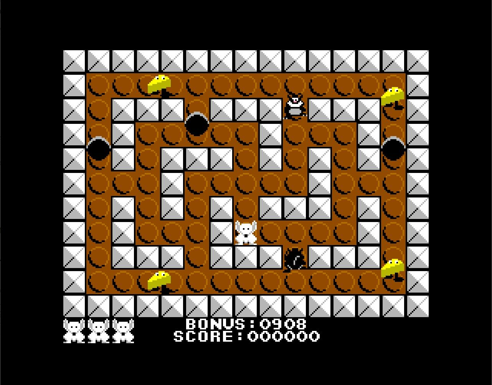

# Cat and Mouse
## A simple machine code maze game by Steve Monks



# Intro
Back in the 80's I wrote a couple of machine code games for the ZX Spectrum, these were Piggy, a game that vaguely resembled Mr. Do, written without ever having played Mr. Do (it was originally and somewhat naively called Mr. Don't, but was reworked into Piggy for a promotional tie in that ultimately fell through), and Dogsbody, a game in the vein of Boulder Dash, again, written without having ever played Boulder Dash and I dare say lacking its charm, design and ingenuity, it did at least have boulders in it, so there's that.

Both were released publicly in one form or another, Piggy featured on an Argus Press Software tape magazine and Dogsbody was one of the Bug Byte relaunch titles, it also ended up in some of the game compilation packs that became available shortly after (I even ported it to the Amstrad CPC464 and more recently the BBC Micro).

A favourite amongst the handful of unreleased games I've written over the years is Cat and Mouse. This was originally conceived as a simple maze game on the ZX Spectrum, with very basic graphics in the style of the early consoles such as the Atari VCS or Phillips G7000.

I think the original was written over a handful of days and I thought it was a fun little project as well as a good programming exercise. So much so, that when the Amiga came along a couple of years later I rewrote it for that as an exercise to teach myself the C programming language, keeping the same crap graphics as the original, but remaking them with super smooth pixel animated sprites.

Some years later (2005 apparently) I was dabbling around with programming the Game Boy Advance and I once again used Cat and Mouse as an exercise to familarise myself with that platform.

Which brings us to the present day where my long awaited ZX Spectrum Next has finally arrived.

After some initial excitement setting it up and playing around with the pre installed games and demos I put it to one side and wondered what to do with it.

After a few weeks of inactivity I decided I'd have a bit of a dabble programming it, so I dug out my old copy of Rodney Zaks' "Programming The Z80", found some online ZX Spectrum Next hardware reference and set to trying to display a sprite on screen.

After some initial success with this I decided to have a play around with tilemaps, which also proved quite straightforward to get going.

With these two elements in place, I had sufficient knowledge to attempt putting a simple game together, but what game would that be? It had to be something relatively simple, where I wouldn't need to spend too much time designing graphics or gameplay. It was at this point I stumbled across the source code to my GBA port of Cat and Mouse. This had bmps containing the character animations and the maze definitions were right there as ASCII strings in the code.

And so I set about rewriting Cat and Mouse for the fourth time. Although I've almost certainly got the source code for the original Spectrum version knocking around on a floppy somewhere, it would be a pain getting it across to the PC, so I decided to rewrite the code from scratch which has kept me occupied in the evenings during this first couple of weeks of lockdown in the UK.

But I wanted to go one better than just writing a simplistic maze game for this new platform, I wanted to release the code too.

As the game is relatively basic, the code should be reasonably easy to follow and much of the code design and structure presented here can be applied to far more ambitious games on this and other platforms, I know, as I've made a successful career out of writing computer games for the past 25 years, working on dozens of AAA games throughout that time.

Assembly language is rarely used in the industry these days, hell, even plain old "C" is considered low level in most quarters, so it's been an enjoyable treat getting my hands dirty with this stuff again, and hopefully someone will find what I've written here useful as a tutorial or as starting point for their own projects.

# Getting Started
All of the code and data for the game can be found in the "asm" folder. It's been written to be assembled with Simon Brattel's excellent Zeus cross assembler, so the first thing you'll need is a copy of that. I've built it with Version 3.98 of zcl.exe (the command line version of Zeus), so it should build without issues with that specific version and hopefully without problems on later versions too.

With the command line version of Zeus in your path, the game can be built by opening a console window, navigating to the asm folder and typing;

```
zcl.exe candm.asm
```

Similarly, with the IDE version, just load candm.asm and the IDE will find and load all of the other files.

Once assembled, a candm.snx file should have been generated, this is essentially a .sna file (a long established archive file format for snapshots of Spectrum games), but when renamed with the .snx extension the Next treats this as a signal to enable its unique hardware.

This should be runnable on real ZX Spectrum Next (it works fine on mine), I've also tested it on Mike Dailly's excellent CSpect emulator, in fact most of the development testing was carried out using CSpect, so this is an ideal choice if you're not lucky enough to own actual ZX Spectrum Next hardware.

Follow the instructions on Mike's site to install and configure CSpect, copy the file c-spect-next.bat from this repository into the same folder as CSpect.exe and then double click on the batch file to launch CSpect with all of the necessary Next hardware features enabled.

Once CSpect is running, hit F2 to load a snapshot and navigate to the asm folder and select candm.snx to launch it.

# Code Overview
The code files that make up this project are as follows;

* candm.asm - this is the file which links all of the other project files together and tells Zeus where to place the different pieces of code and data in memory.
* next.s - this is the main entry point to the code. It configures the Next hardware used by the game (i.e. the tilemap, sprites and CPU speed) and then jumps to the game logic.
* nextreg.i - human readable labels for all of the Next registers used by the game.
* gamelogic.s - this file controls the main flow of the game, from the rudimentary title screen, through the pause as we enter the game and into the main game loop itself. The various pieces of text written to the screen are also defined in here.
* gameobj.s - this file declares the game objects used to manage the various characters that move around in the game. It provides mechanisms to create and update them, as well as generic functions to handle collision between each other and the walls of the maze.
* ai.s - this file contains the logic that moves the computer controlled characters around the maze. The functions here can be configured to chase the player or attempt to run away from him.
* setuplevel.s - this file takes the current maze description to create and place the various gameobjects it describes (e.g. the player, the cheese, the cats and the holes). This is invoked once at the beginning of each level or after a restart.
* tilewriter.s - this file takes the current maze and populates the tilemap with the tiles required to display it on screen. This is invoked once at the beginning of each level or after a restart.
* textwriter.s - a simple set of text printing functions that write characters into the tilemap. These are used to draw the score, bonus and other messages seen throughout the game.
* player.s - this file contains code to initialise the player and the logic to allow the player to move around the maze under player control by both the keyboard and Kempston joystick without running through the walls of the maze.
* cat.s - this file contains code to initialise the cats and the logic to move them around.
* cheese.s - this file contains code to initialise the cheese and the logic to move them around.
* hole.s - this file contains code to initialise the holes and the logic to move them around.

# Data Overview
All of the data used by this game is defined using standard assembler directives and assembled by Zeus along with the rest of the code. The sprites and tiles were created using my online sprite editor NextDes (www.stevemonks.com/nextdes/) and the mazes are hand edited in plain ASCII, with each ASCII character representing a 16x16 on screen block (2x2 tiles). The files are;
* gamesprites.s - the 16x16 16 colour sprites and their palette.
* Backg.s - the 16 colour background tile patterns.
* glyphs.s - the tile patterns for the font.
* maps.s - the maze definitions. As mentioned above, these are plain ASCII arrays, 16 characters wide and 11 characters high with each character representing a 2x2 tile block. The characters represented are as follows;
    * 'p' - player start location
    * 'c' - cheese
    * 'm' - cats (c was already taken!)
    * 'h' - hole
    * '*' - maze wall
    * ' ' - maze floor
    * '.' - empty character - used exclusively to pad out the right hand edge

